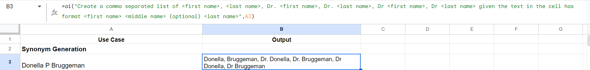

# AI Function In Google Sheets

Google introduced [AI function](https://support.google.com/docs/answer/15877199?hl=en_SE) in alpha and I gave it a try for a few use cases which I come across on a day to day basis for my work, some of which I solve through formulae.

Go through how to use it and its limitations (link above) before reading further.

This is just a first attempt getting familiarized with AI Function so I would like to play around more to understand its strengths/weaknesses/limitations/behavior etc.

## Usecase 1: Synonym generation

Of course synonym generation with such patterns where for a given Doctor name (First and Last) one needs to create variations as first name, last name, Dr./Dr first name or last name can easily be done using formulae but might require sometime to figure out formula, now one can reply on AI to do it quickly as at the end of the day it is a textual output

## Usecase 2: Named entity recognition

This one is interesting where if you want to extract out proper nouns or named entities from a sentence or piece of text then this function comes in handy. Though I haven't tried it with lot many examples but I am expecting it to be more often to be correct than incorrect.

## Usecase 3: Paraphrase generation

LLMs are good at parpaphrase generation so having this feature in a spreadsheet is really handy for those who don't want to go through hassle of going via code/API route to create variations of the sentence or piece of text.

## Usecase 4: Intent detection

Again strenght of LLMs is in detecting the intent for a piece of text. Notice how change in instructions/prompt can product different/desired output so got to play around with prompt more.

With prompt highlighted

With output highlighted

## Usecase 5: JSON parsing/value extraction

This one was a delight for me where I just pasted a nested JSON structure and wanted to extract value of keys in random order and wanted to convert it into flat structure and the formula did wonders.

Extracting values of keys

Flattening out the entire nested JSON structure

